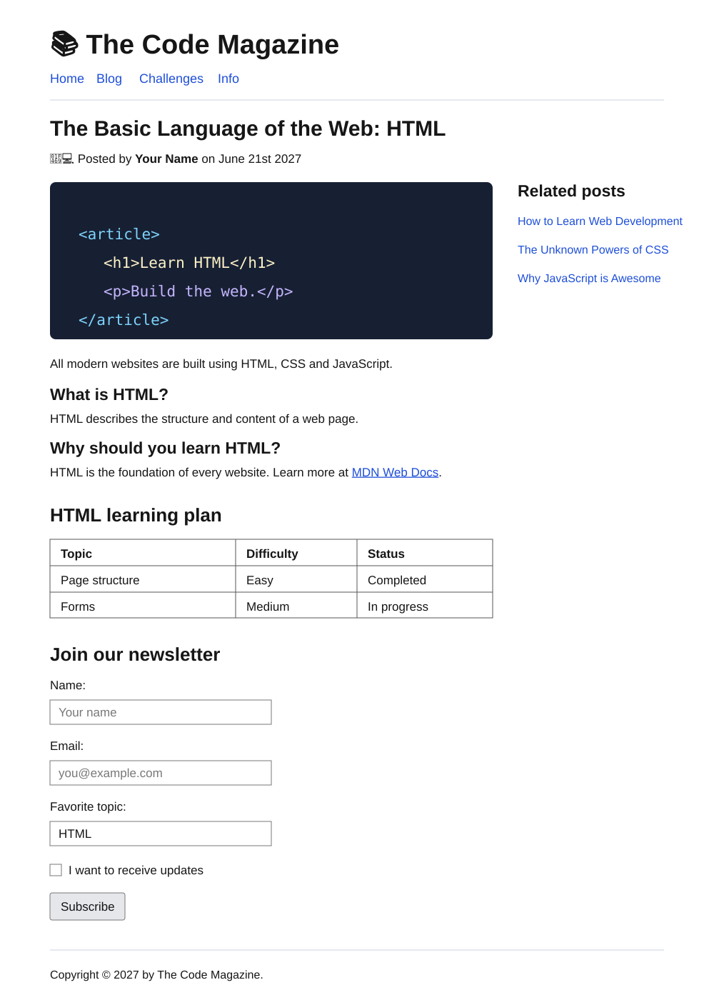

# HTML დავალება #1 — The Code Magazine

> **განახლებული საბოლოო ვერსია:** დავალება ბარდება GitHub-ის public repository-ის ბმულით — ZIP არქივი არ არის საჭირო.

## დავალების მიზანი

ამ დავალების შესრულებისას ივარჯიშებთ:

- HTML დოკუმენტის საბაზისო სტრუქტურის შექმნაზე;
- სემანტიკური ელემენტების გამოყენებაზე;
- სათაურების, ტექსტის, სურათებისა და ბმულების დამატებაზე;
- რამდენიმე HTML გვერდის ერთმანეთთან დაკავშირებაზე.
- ცხრილის საშუალებით მონაცემების ორგანიზებაზე;
- მარტივი HTML ფორმის შექმნაზე;
- პროექტის GitHub-ზე ატვირთვასა და repository-ის ბმულის გაზიარებაზე.

> **მნიშვნელოვანი:** ამ ეტაპზე გამოიყენეთ მხოლოდ HTML. გვერდის გაფორმება CSS-ით სავალდებულო არ არის.

---

## 1. პროექტის მომზადება

1. `Desktop`-ზე შექმენით ახალი საქაღალდე და დაარქვით `the-code-magazine`.
2. გახსენით შექმნილი საქაღალდე Visual Studio Code-ში.
3. საქაღალდეში შექმენით შემდეგი ფაილები:

```text
the-code-magazine/
├── index.html
├── blog.html
└── info.html
```

4. სამივე ფაილში შექმენით HTML დოკუმენტის სრული საბაზისო სტრუქტურა.
5. თითოეული დოკუმენტის `<title>` ელემენტში ჩაწერეთ შესაბამისი ტექსტი:

| ფაილი | `<title>`-ის ტექსტი |
| --- | --- |
| `index.html` | `Home` |
| `blog.html` | `Blog` |
| `info.html` | `Info` |

მთავარი გვერდის ქვემოთ აღწერილი სრული შინაარსი ააწყვეთ `index.html` ფაილში.

---

## 2. Header — გვერდის ზედა ნაწილი

`<body>` ელემენტში დაამატეთ `<header>` სექცია.

Header-ში მოათავსეთ:

- პირველი დონის სათაური (`<h1>`) ტექსტით: **📚 The Code Magazine**;
- ნავიგაცია (`<nav>`), რომელშიც იქნება ოთხი ბმული (`<a>`):
  - `Blog` — უნდა გადადიოდეს `blog.html` გვერდზე;
  - `Challenges` — დროებით გამოიყენეთ `href="#"`;
  - `CSS Flexbox` — დროებით გამოიყენეთ `href="#"`;
  - `CSS Grid` — დროებით გამოიყენეთ `href="#"`.

> ყველა `<a>` ელემენტს აუცილებლად უნდა ჰქონდეს `href` ატრიბუტი.

---

## 3. Article — მთავარი სტატია

Header-ის შემდეგ დაამატეთ `<article>` ელემენტი და შექმენით სტატია თემაზე **HTML-ის საფუძვლები**.

სტატიაში ლოგიკურად გამოიყენეთ ყველა ჩამოთვლილი ელემენტი:

- `<div>` — დაკავშირებული ელემენტების დასაჯგუფებლად;
- `<h2>` — სტატიის მთავარი სათაურისთვის;
- `<h3>` — სტატიის ქვეთავებისთვის;
- `` — სტატიისა და ავტორის სურათებისთვის;
- `<p>` — აბზაცებისთვის;
- `<em>` — ტექსტზე ემფაზის გასაკეთებლად;
- `<strong>` — მნიშვნელოვანი ტექსტის გამოსაყოფად;
- `<b>` — მხოლოდ ვიზუალურად გასამუქებელი ტექსტისთვის;
- `<a>` — დამატებით რესურსზე გადასასვლელად.

### სტატიის სავალდებულო შინაარსი

სტატიაში უნდა ჩანდეს:

1. სათაური: `The Basic Language of the Web: HTML`;
2. ავტორის სურათი;
3. ავტორის სახელი და გამოქვეყნების თარიღი;
4. მთავარი სურათი HTML-ის ან პროგრამირების თემაზე;
5. მინიმუმ სამი აბზაცი;
6. მინიმუმ ორი ქვეთავი, მაგალითად:
   - `What is HTML?`
   - `Why should you learn HTML?`
7. ბმული MDN-ის HTML სასწავლო რესურსზე:
   <https://developer.mozilla.org/en-US/docs/Learn/HTML>

### სურათების მოთხოვნები

- შეგიძლიათ გამოიყენოთ თქვენთვის სასურველი სურათები;
- ყველა `` ელემენტს უნდა ჰქონდეს `src` და აღწერითი `alt` ატრიბუტები;
- სურათები შეგიძლიათ შეინახოთ ცალკე `images` საქაღალდეში ან გამოიყენოთ ინტერნეტ-მისამართი.

---

## 4. Aside — დამატებითი სტატიები

`<article>` ელემენტის შემდეგ დაამატეთ `<aside>` სექცია.

Aside-ში შექმენით ბლოკი სათაურით `Related posts` და დაამატეთ სამი დაკავშირებული სტატია. თითოეულისთვის გამოიყენეთ:

- `` — სტატიის სურათი;
- `<a>` — სტატიის სათაური და ბმული;
- `<p>` — ავტორის ან მოკლე აღწერის ტექსტი.

ბმულები უნდა გადადიოდეს შემდეგ მისამართებზე:

1. [How to Learn Web Development](https://developer.mozilla.org/en-US/docs/Learn)
2. [The Unknown Powers of CSS](https://code-hl.com/html-and-css/tutorials/unlocking-the-power-of-css)
3. [Why JavaScript is Awesome](https://dev.to/inspiratory/reasons-why-javascript-is-awesome-5pf)

> გარე ბმულები გახსენით ახალ ჩანართში `target="_blank"` ატრიბუტის გამოყენებით. უსაფრთხოებისთვის ასევე დაამატეთ `rel="noopener noreferrer"`.

---

## 5. Footer — გვერდის ქვედა ნაწილი

გვერდის ბოლოს დაამატეთ `<footer>` ელემენტი და მასში მოათავსეთ შემდეგი ტექსტი:

```text
Copyright © 2027 by The Code Magazine.
```

© სიმბოლო HTML-ში შექმენით `&copy;` entity-ის გამოყენებით.

---

## 6. დამატებითი გვერდები

`blog.html` და `info.html` არ უნდა დარჩეს ცარიელი. ორივე გვერდზე გაიმეორეთ მთავარი გვერდის Header და Footer, რათა ნავიგაცია ყველა გვერდიდან იყოს შესაძლებელი.

### `blog.html` — სასწავლო გეგმის ცხრილი

გვერდზე დაამატეთ:

- `<h1>` სათაურით `HTML Learning Plan`;
- ერთი მოკლე `<p>`, რომელიც აღწერს ცხრილის დანიშნულებას;
- `<table>`, რომელშიც HTML თემების სასწავლო გეგმა იქნება წარმოდგენილი.

ცხრილში გამოიყენეთ:

- `<caption>` — ცხრილის სათაურისთვის;
- `<thead>` — სათაურების მწკრივისთვის;
- `<tbody>` — ძირითადი მონაცემებისთვის;
- `<tr>` — თითოეული მწკრივისთვის;
- `<th>` — სვეტების სათაურებისთვის;
- `<td>` — მონაცემების უჯრებისთვის.

ცხრილს უნდა ჰქონდეს სამი სვეტი:

| Topic | Difficulty | Status |
| --- | --- | --- |
| Page Structure | Easy | Completed |
| Text Elements | Easy | Completed |
| Tables | Medium | In Progress |
| Forms | Medium | In Progress |

> ცხრილის ჩარჩოს გამოსაჩენად შეგიძლიათ `<table border="1">` გამოიყენოთ. ეს მხოლოდ ამ დავალებისთვის არის დაშვებული; მოგვიანებით ცხრილის ვიზუალურ გაფორმებას CSS-ით გააკეთებთ.

### `info.html` — მარტივი საკონტაქტო ფორმა

გვერდზე დაამატეთ:

- `<h1>` სათაურით `Join Our Newsletter`;
- მოკლე `<p>`, რომელიც მომხმარებელს ფორმის შევსებისკენ მოუწოდებს;
- `<form>` ელემენტი.

ფორმაში გამოიყენეთ:

1. სახელის ველი:
   - `<label>` ტექსტით `Name`;
   - ტექსტური `<input>`;
   - ატრიბუტები: `type="text"`, `id`, `name`, `placeholder` და `required`.
2. ელფოსტის ველი:
   - `<label>` ტექსტით `Email`;
   - `<input type="email">`;
   - ატრიბუტები: `id`, `name`, `placeholder` და `required`.
3. საყვარელი თემის ასარჩევი სია:
   - `<label>` ტექსტით `Favorite topic`;
   - `<select>` სამი `<option>` ელემენტით: `HTML`, `CSS`, `JavaScript`.
4. თანხმობის checkbox:
   - `<input type="checkbox">`;
   - ტექსტი: `I want to receive updates`.
5. გაგზავნის ღილაკი:
   - `<button type="submit">Subscribe</button>`.

> თითოეული `<label>`-ის `for` მნიშვნელობა უნდა ემთხვეოდეს შესაბამისი ველის `id` მნიშვნელობას. ფორმას რეალურად მონაცემების გაგზავნა ჯერ არ მოეთხოვება — ამ დავალებაში მხოლოდ მისი HTML სტრუქტურა იქმნება.

ორივე დამატებით გვერდზე ასევე დაამატეთ:

- ბმული `index.html` მთავარ გვერდზე დასაბრუნებლად.

---

## 7. მოსალოდნელი შედეგის ვიზუალური ნიმუში

ქვემოთ მოცემული სურათი მხოლოდ **სტრუქტურის ნიმუშია**. თქვენი ტექსტი და სურათები შეიძლება განსხვავებული იყოს. CSS-ის გამოყენება სავალდებულო არ არის, ამიტომ ბრაუზერის სტანდარტული ვიზუალი სრულიად მისაღებია.



---

## ჩაბარების ფორმატი

დავალება ატვირთეთ GitHub-ზე **public repository**-ის სახით და ჩასაბარებლად გამოგზავნეთ repository-ის ბმული.

Repository-ში უნდა იყოს:

- `index.html`;
- `blog.html`;
- `info.html`;
- გამოყენებული ლოკალური სურათები, თუ ისინი პროექტში გაქვთ შენახული;
- მინიმუმ ერთი გასაგები commit message, მაგალითად: `Complete HTML assignment`.

ბმულის მაგალითი:

```text
https://github.com/username/the-code-magazine
```

> ჩაბარებამდე გახსენით repository-ის ბმული private/incognito ფანჯარაში და დარწმუნდით, რომ ის ხელმისაწვდომია.

---

## თვითშემოწმების Checklist

ჩაბარებამდე გადაამოწმეთ:

- [ ] პროექტში სამივე HTML ფაილი არსებობს;
- [ ] სამივე ფაილს აქვს HTML-ის სრული საბაზისო სტრუქტურა;
- [ ] თითოეულ გვერდს შესაბამისი `<title>` აქვს;
- [ ] `index.html`-ში გამოყენებულია `<header>`, `<nav>`, `<article>`, `<aside>` და `<footer>`;
- [ ] ყველა ბმულს აქვს სწორი `href`;
- [ ] `Blog` ბმული ხსნის `blog.html` გვერდს;
- [ ] დამატებითი გვერდებიდან შესაძლებელია მთავარ გვერდზე დაბრუნება;
- [ ] `blog.html` გვერდზე არის `<table>`, სათაური და მინიმუმ ოთხი მონაცემთა მწკრივი;
- [ ] `info.html` გვერდზე არის `<form>`, ყველა მოთხოვნილი ველი და Submit ღილაკი;
- [ ] ყველა `label` სწორად არის დაკავშირებული შესაბამის ველთან;
- [ ] სავალდებულო ფორმის ველებს აქვთ `required` ატრიბუტი;
- [ ] ყველა სურათს აქვს აღწერითი `alt` ტექსტი;
- [ ] გარე ბმულები ახალ ჩანართში იხსნება;
- [ ] გვერდზე არ ჩანს გაფუჭებული სურათი ან არასწორი ბმული;
- [ ] HTML კოდი სწორად არის დალაგებული indentation-ის გამოყენებით;
- [ ] პროექტი ბრაუზერში გახსენით და ყველა ნაწილი შეამოწმეთ.
- [ ] პროექტი ატვირთულია public GitHub repository-ში და ბმული იხსნება.

## ბონუს დავალება — სურვილისამებრ

- დაამატეთ `info.html` გვერდის ბმული ნავიგაციაში;
- სტატიის გამოქვეყნების თარიღისთვის გამოიყენეთ სემანტიკური `<time>` ელემენტი;
- შეამოწმეთ თქვენი HTML [W3C Markup Validation Service](https://validator.w3.org/)-ის დახმარებით და გამოასწორეთ აღმოჩენილი შეცდომები.

წარმატებები! 🚀
