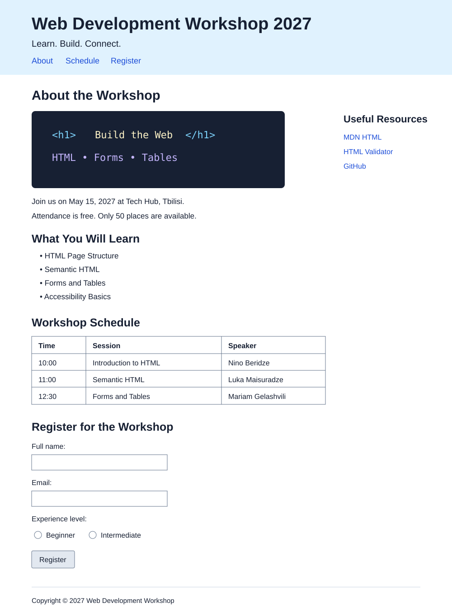

# HTML სალექციო პრაქტიკა — Web Development Workshop

## დავალების ფორმატი

ეს არის ლექციაზე შესასრულებელი პრაქტიკული დავალება. იმუშავეთ ინდივიდუალურად ან წყვილებში.

- რეკომენდებული დრო: **40–50 წუთი**;
- გამოიყენეთ მხოლოდ **HTML**;
- CSS და JavaScript ამ ეტაპზე საჭირო არ არის;
- დავალების ბოლოს რამდენიმე სტუდენტი წარადგენს საკუთარ ნამუშევარს.

---

## მიზანი

შექმენით ერთგვერდიანი ვებგვერდი გამოგონილი ღონისძიებისთვის — **Web Development Workshop 2027**.

ამ პრაქტიკისას გამოიყენებთ:

- HTML დოკუმენტის საბაზისო სტრუქტურას;
- სემანტიკურ ელემენტებს;
- სათაურებსა და აბზაცებს;
- სიებს;
- სურათებსა და ბმულებს;
- ცხრილს;
- მარტივ სარეგისტრაციო ფორმას.

---

## 1. პროექტის მომზადება — 5 წუთი

1. Desktop-ზე შექმენით საქაღალდე სახელით `workshop-page`.
2. გახსენით საქაღალდე Visual Studio Code-ში.
3. შექმენით `index.html` ფაილი.
4. დაამატეთ HTML დოკუმენტის სრული საბაზისო სტრუქტურა.
5. `<title>` ელემენტში ჩაწერეთ `Web Development Workshop`.
6. `<html>` ელემენტს დაუმატეთ შესაბამისი `lang` ატრიბუტი.

---

## 2. Header და ნავიგაცია — 5 წუთი

`<header>` ელემენტში დაამატეთ:

- `<h1>` ტექსტით `Web Development Workshop 2027`;
- მოკლე სლოგანი `<p>` ელემენტში: `Learn. Build. Connect.`;
- `<nav>` სამი ბმულით:
  - `About` → `#about`;
  - `Schedule` → `#schedule`;
  - `Register` → `#register`.

> ეს ბმულები იმავე გვერდის შესაბამის სექციებზე უნდა გადადიოდეს. ამისთვის სექციებს შესაბამისი `id` ატრიბუტები მიანიჭეთ.

---

## 3. ღონისძიების შესახებ — 8 წუთი

`<main>` ელემენტში შექმენით `<section id="about">`.

სექციაში დაამატეთ:

- `<h2>` ტექსტით `About the Workshop`;
- ღონისძიების თემატიკის შესაბამისი ``;
- მინიმუმ ორი `<p>` აბზაცი;
- თარიღი `<time>` ელემენტის გამოყენებით;
- ღონისძიების ადგილი `<address>` ელემენტში;
- მნიშვნელოვანი ტექსტისთვის `<strong>`;
- ემფაზისთვის `<em>`.

ყველა სურათს უნდა ჰქონდეს აღწერითი `alt` ატრიბუტი.

### სავალდებულო ინფორმაცია

- თარიღი: `May 15, 2027`;
- ადგილი: `Tech Hub, Tbilisi`;
- დასწრება: `Free`;
- ადგილების რაოდენობა: `50`.

---

## 4. რას ისწავლიან მონაწილეები — 5 წუთი

დაამატეთ ახალი სექცია სათაურით `What You Will Learn`.

შექმენით unordered list (`<ul>`) შემდეგი თემებით:

- HTML Page Structure;
- Semantic HTML;
- Forms and Tables;
- Accessibility Basics.

შემდეგ დაამატეთ სათაური `What to Bring` და ordered list (`<ol>`):

1. Laptop;
2. Charger;
3. Notebook;
4. Curiosity.

---

## 5. ღონისძიების განრიგი — 8 წუთი

შექმენით `<section id="schedule">` სათაურით `Workshop Schedule`.

სექციაში დაამატეთ `<table border="1">`.

გამოიყენეთ:

- `<caption>`;
- `<thead>`;
- `<tbody>`;
- `<tr>`;
- `<th>`;
- `<td>`.

ცხრილში წარმოადგინეთ შემდეგი მონაცემები:

| Time | Session | Speaker |
| --- | --- | --- |
| 10:00 | Introduction to HTML | Nino Beridze |
| 11:00 | Semantic HTML | Luka Maisuradze |
| 12:00 | Break | — |
| 12:30 | Forms and Tables | Mariam Gelashvili |
| 14:00 | Final Practice | Mentors |

> ცხრილში დროის მნიშვნელობებისთვის შეგიძლიათ `<time>` ელემენტიც გამოიყენოთ.

---

## 6. სარეგისტრაციო ფორმა — 12 წუთი

შექმენით `<section id="register">` სათაურით `Register for the Workshop`.

სექციაში დაამატეთ `<form>`, რომელშიც იქნება:

### პირადი ინფორმაცია

1. სრული სახელი:
   - `<label>`;
   - `<input type="text">`;
   - `name`, `id`, `placeholder` და `required` ატრიბუტები.
2. ელფოსტა:
   - `<label>`;
   - `<input type="email">`;
   - `name`, `id`, `placeholder` და `required` ატრიბუტები.

### გამოცდილების დონე

გამოიყენეთ სამი radio button ერთი და იმავე `name` მნიშვნელობით:

- Beginner;
- Intermediate;
- Advanced.

### სასურველი თემა

შექმენით `<select>` ელემენტი შემდეგი `<option>`-ებით:

- HTML Basics;
- Semantic HTML;
- Forms and Tables.

### დამატებითი ინფორმაცია

- დაამატეთ `<textarea>` კითხვით `What do you expect from this workshop?`;
- დაამატეთ checkbox ტექსტით `I agree to receive workshop updates`;
- დაამატეთ `<button type="submit">Register</button>`.

> ყველა `<label>`-ის `for` ატრიბუტი უნდა ემთხვეოდეს შესაბამისი ველის `id` მნიშვნელობას. ფორმას მონაცემების რეალურად გაგზავნა არ მოეთხოვება.

---

## 7. Aside და Footer — 5 წუთი

### Aside

დაამატეთ `<aside>` სათაურით `Useful Resources` და სამი გარე ბმული:

- [MDN HTML](https://developer.mozilla.org/en-US/docs/Web/HTML)
- [HTML Validator](https://validator.w3.org/)
- [GitHub](https://github.com/)

გარე ბმულები ახალ ჩანართში გახსენით და გამოიყენეთ:

```text
target="_blank" rel="noopener noreferrer"
```

### Footer

`<footer>` ელემენტში დაამატეთ:

```text
Copyright © 2027 Web Development Workshop
```

© სიმბოლოსთვის გამოიყენეთ `&copy;`.

---

## მოსალოდნელი შედეგის ვიზუალური ნიმუში

ეს სურათი მხოლოდ გვერდის **შინაარსისა და სტრუქტურის ნიმუშია**. CSS-ის გარეშე თქვენი გვერდის ვიზუალი შეიძლება ოდნავ განსხვავდებოდეს.



---

## სწრაფი თვითშემოწმება

- [ ] დოკუმენტს აქვს `<!DOCTYPE html>` და სრული HTML სტრუქტურა;
- [ ] გამოყენებულია `<header>`, `<nav>`, `<main>`, `<section>`, `<aside>` და `<footer>`;
- [ ] ნავიგაციის ბმულები შესაბამის სექციებზე გადადის;
- [ ] გვერდზე არის სათაურები, აბზაცები, სურათი და ორივე ტიპის სია;
- [ ] სურათს აქვს აღწერითი `alt`;
- [ ] ცხრილს აქვს `<caption>`, `<thead>` და `<tbody>`;
- [ ] ფორმაში არის text, email, radio, checkbox, select და textarea ველები;
- [ ] ყველა label დაკავშირებულია შესაბამის ველთან;
- [ ] სავალდებულო ველებს აქვს `required`;
- [ ] გვერდზე მხოლოდ ერთი `<h1>` ელემენტია;
- [ ] HTML კოდი სწორად არის დალაგებული indentation-ის გამოყენებით;
- [ ] გვერდი შემოწმებულია ბრაუზერში.

## ბონუსი — თუ დრო დარჩება

- ფორმის ველები დააჯგუფეთ `<fieldset>` და `<legend>` ელემენტებით;
- ღონისძიების საკონტაქტო ელფოსტა შექმენით `mailto:` ბმულად;
- დაამატეთ `Back to top` ბმული, რომელიც გვერდის დასაწყისში აბრუნებს მომხმარებელს;
- შეამოწმეთ HTML W3C Validator-ის დახმარებით.

წარმატებები! 🚀
